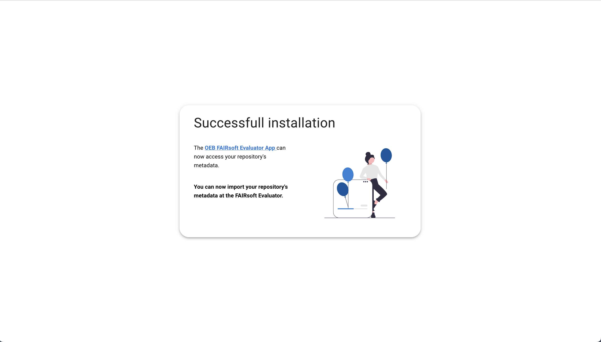

# post-installation

This repository contains the fallback page for the [OEB FAIRsoft Evaluator](https://github.com/apps/oeb-fairsoft-evaluator) app installation. This means that when the [OEB FAIRsoft Evaluator](https://github.com/apps/oeb-fairsoft-evaluator) app  is installed on a repository, the user will be redirected to this page. 

This page is a simple static page composed by one "page": the [index.vue](./pages/index.vue) page. This page looks somthing like this:



## GitHub pages
This page uses GitHub pages to be hosted. The GitHub pages is configured to use the `gh-pages` branch, `docs` directory, as the source for the GitHub pages. This means that the `gh-pages` branch is the one that contains the static files that are served by GitHub pages. To generate the static files, the following commands are used:

```bash
# switch to gh_pages branch
$ git checkout gh-pages

# generate static files
$ npm run generate

# commit and push changes
$ git add .
$ git commit -m "update static files"
```

After this, the `gh-pages` branch is updated and the static files are served by GitHub pages. 

### Nuxt configuration 
In addition to the GitHub pages configuration, the [nuxt.config.js](./nuxt.config.js) file contains some configuration that is needed to make sure that the static files are served correctly.

#### Docs directory
To generate the static files in the `docs` directory, the following configuration is used in the [nuxt.config.js](./nuxt.config.js) file:

```js
generate: {
    dir: 'docs'
  },
```

#### Router base
To make sure that the static files are served correctly, the `router.base` property is set to the name of the repository. This is done in the [nuxt.config.js](./nuxt.config.js) file:

```js
router: {     
    base: '/oeb-fairsoft-evaluator-post-installation/'   
  },
```


## Build Setup

```bash
# install dependencies
$ npm install

# serve with hot reload at localhost:3000
$ npm run dev

# build for production and launch server
$ npm run build
$ npm run start

# generate static project
$ npm run generate
```

For detailed explanation on how things work, check out the [documentation](https://nuxtjs.org).

